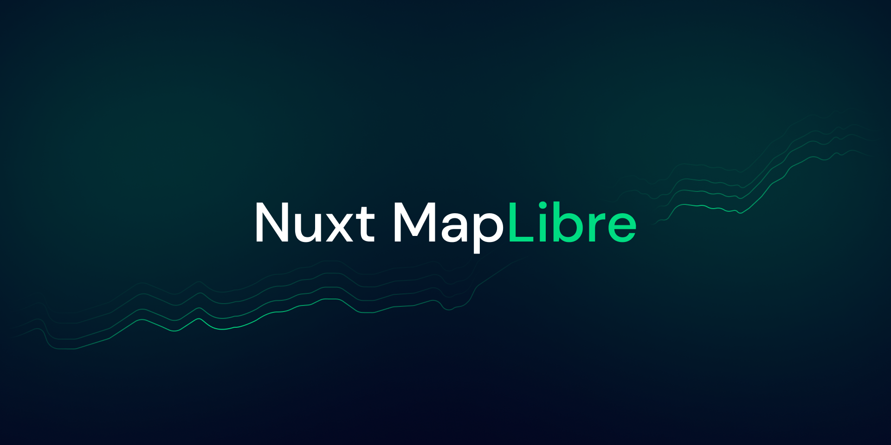

[](https://gugustinette.github.io/nuxt-maplibre)

# Nuxt Maplibre

[![npm version][npm-version-src]][npm-version-href]
[![npm downloads][npm-downloads-src]][npm-downloads-href]
[![License][license-src]][license-href]
[![Nuxt][nuxt-src]][nuxt-href]

A Nuxt module to use MapLibre.
It was made using [vue-maplibre-gl](https://indoorequal.github.io/vue-maplibre-gl/) which is a Vue 3 wrapper for [MapLibre](https://maplibre.org/), that exposes the original MapLibre API as Vue components.

This module is really just about making it work with Nuxt without the need to configure anything.

- [✨ &nbsp;Release Notes](/CHANGELOG.md)
- [📖 &nbsp;Documentation](https://gugustinette.github.io/nuxt-maplibre)

## Features

- ⚡ &nbsp;No configuration needed
- 🦺 &nbsp;Typescript support
- 🚠 &nbsp;Auto import

## Quick Setup

```bash
npx nuxi@latest module add nuxt-maplibre
```

That's it! You can now use MapLibre in your Nuxt app ✨

## Usage

For a complete list of the components available, check out the [vue-maplibre-gl documentation](https://indoorequal.github.io/vue-maplibre-gl/examples/basic.html).

### Basic

```vue
<template>
  <MglMap
    :map-style="style"
    :center="center"
    :zoom="zoom"
  >
    <MglNavigationControl />
  </MglMap>
</template>

<script setup>
const style = 'https://api.maptiler.com/maps/streets/style.json?key=cQX2iET1gmOW38bedbUh';
const center = [-1.559482, 47.21322];
const zoom = 8;
</script>
```

## Development

```bash
# Install dependencies
npm install

# Generate type stubs
npm run dev:prepare

# Develop with the playground
npm run dev

# Build the playground
npm run dev:build

# Run ESLint
npm run lint

# Run Vitest
npm run test
npm run test:watch

# Release new version
npm run release
```

<!-- Badges -->
[npm-version-src]: https://img.shields.io/npm/v/nuxt-maplibre/latest.svg?style=flat&colorA=18181B&colorB=28CF8D
[npm-version-href]: https://www.npmjs.com/package/nuxt-maplibre

[npm-downloads-src]: https://img.shields.io/npm/dm/nuxt-maplibre.svg?style=flat&colorA=18181B&colorB=28CF8D
[npm-downloads-href]: https://www.npmjs.com/package/nuxt-maplibre

[license-src]: https://img.shields.io/npm/l/nuxt-maplibre.svg?style=flat&colorA=18181B&colorB=28CF8D
[license-href]: https://www.npmjs.com/package/nuxt-maplibre

[nuxt-src]: https://img.shields.io/badge/Nuxt-18181B?logo=nuxt.js
[nuxt-href]: https://nuxt.com
